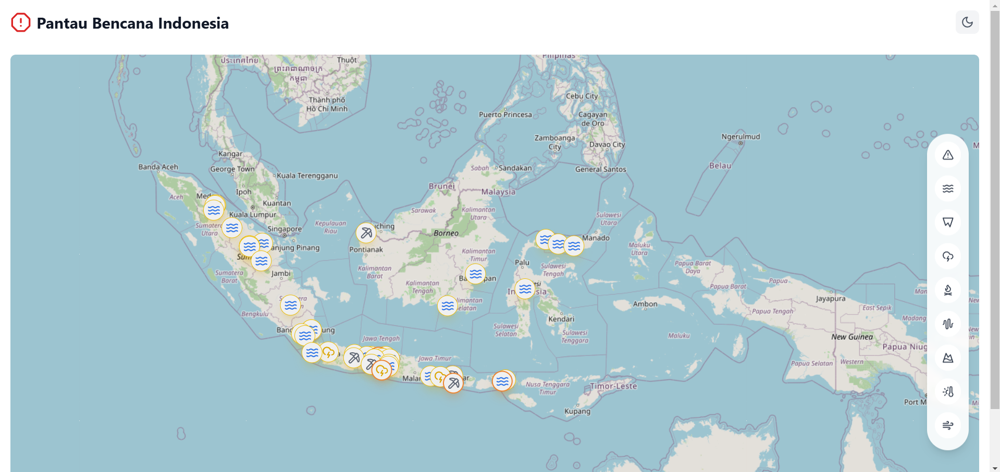

# Sistem Pemantauan Data Bencana Indonesia

Website interaktif berbasis cloud yang menyajikan informasi real-time mengenai bencana alam di Indonesia dengan memanfaatkan teknologi React, Leaflet.js, dan Amazon Web Services (AWS). Sistem ini dirancang untuk memberikan akses mudah dan cepat kepada masyarakat serta pemangku kepentingan terkait mitigasi bencana.

[](https://zekia-map-bencana-indonesia.vercel.app/)  
[](https://drive.google.com/file/d/1/documentation-link)


## Gambaran Umum

Proyek ini dirancang untuk memvisualisasikan data bencana alam secara real-time menggunakan peta interaktif yang dilengkapi dengan ikon spesifik untuk setiap jenis bencana. Sistem ini memanfaatkan teknologi cloud AWS untuk menjamin skalabilitas dan ketersediaan informasi, serta dirancang responsif agar dapat diakses melalui berbagai perangkat.


## Fitur Utama

- **Real-Time Data**: Informasi bencana terkini langsung dari API BMKG.  
- **Peta Interaktif**: Pengguna dapat mengeksplorasi lokasi bencana dengan fitur zoom, drag, dan klik ikon untuk detail informasi.  
- **Filter Bencana**: Memilih jenis bencana tertentu seperti gempa bumi, banjir, atau tsunami.  
- **Mode Terang/Gelap**: Tampilan yang dapat disesuaikan untuk kenyamanan pengguna.  
- **Responsif**: Dapat diakses dengan optimal di perangkat desktop, tablet, maupun ponsel.


## Teknologi yang Digunakan

  
  
  
  


## Instalasi dan Konfigurasi

1. **Clone repositori:**
   ```bash
   git clone https://github.com/username/project-name.git
   cd project-name
   ```

2. **Instalasi dependensi:**
   ```bash
   npm install
   ```

3. **Konfigurasi file `.env`:**
   Buat file `.env` di root proyek dan masukkan variabel-variabel berikut:
   ```env
   REACT_APP_BMKG_API_KEY=your-api-key
   REACT_APP_AWS_ACCESS_KEY_ID=your-aws-access-key
   REACT_APP_AWS_SECRET_ACCESS_KEY=your-aws-secret-key
   ```

4. **Menjalankan aplikasi lokal:**
   ```bash
   npm run dev
   ```

5. **Deployment ke Vercel:**
   - Hubungkan repositori ke akun Vercel.
   - Atur variabel lingkungan yang sama pada pengaturan proyek di Vercel.
   - Lakukan deployment melalui dashboard Vercel.


## Cara Penggunaan

1. **Akses Website**: Buka [website](https://zekia-map-bencana-indonesia.vercel.app/) melalui browser.  
2. **Eksplorasi Peta**: Gunakan fitur zoom dan drag untuk menjelajahi lokasi bencana di seluruh Indonesia.  
3. **Klik Ikon Bencana**: Dapatkan detail informasi seperti jenis bencana, lokasi, waktu, dan tingkat keparahan.  
4. **Gunakan Filter**: Pilih jenis bencana tertentu melalui tombol di sisi kanan layar.  
5. **Mode Tampilan**: Ubah mode terang/gelap melalui tombol di sudut kanan atas.

## Contoh Tampilan

### Peta Interaktif


### Filter Jenis Bencana
